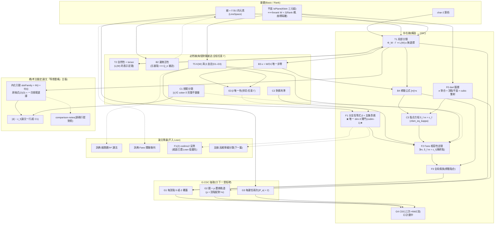

# 項目架構圖紙(真數學依賴)

不是工程進度表:節點 = 數學對象/定理,實線 = 證明中真實使用,虛線 = 詮釋/對照。
本項目的深層結構是**兩條線 + 一座橋**:

- **存在線**(左):從特徵二算術一路構造到 CDC——每個對象「能用」;
- **必然線**(右):T2/B2/C1/E3 逐一證明存在線上每個對象是**被迫的**
  ——分類、泛性、完整不變量、唯一位元。這條線全程與維數無關;
- **橋**(下):把原稿文本錨定為存在線的一次規範選擇。

`dim Γ = 3` 在全圖**恰有一個閘門**:F1(以 codim-1 形式,
Lean 中即 `annihilator_unique` 一條引理)。

## 讀圖要點

1. **兩個匯點**:存在線收於 G4(CDC);必然線沒有匯點——它的四個端點
   (T2、B2、C1、E3)各自「回望」存在線上的一個對象(虛線),宣告其必然性。
   這四條虛線就是論文的「intrinsic necessity」一章。
2. **dim-3 閘門唯一**:F1(`annihilator_unique`)。必然線全程任意 Γ——
   所以「為什麼是 F₂³」的答案在存在線上(計數表示需要 codim 1),
   而不在結構本身。
3. **選擇隔離點**(全部已證無選擇性):κ(`kappa_eq`)、`next` 伴 dart
   (`cfam_eq_kappa`)、E3 的補空間/分離泛函(只進證明不進陳述)、
   Rank 橋的 `decide`(隔離葉檔)。
4. **橋的地位**:SLOT 不在主幹上——刪掉它,兩條線的數學完好無損;
   但「本文是對原證明的等價重構」這一**關於兩個文本之關係**的主張,
   其形式承載就是它。方法論意義上必要,數學意義上外掛。
5. **G(CDC 抽取)設計**:dart 語言的增益延續到底——「圈」不必以頂點路徑
   形式化:在 M_s 的 dart 集上,`ρ := 頂點配對 ∘ σ` 是置換,
   **圈 = ρ-軌道**,分解定理 = 置換軌道分解。G1 由 T1 的覆蓋計數逐頂點
   拉回;G3 由 B1(線 = 二點集)即得。G4 是條件形式
   (三次 + 給定 NWZ 流;8-flow 存在性與三次化約引文獻,不入庫)。
